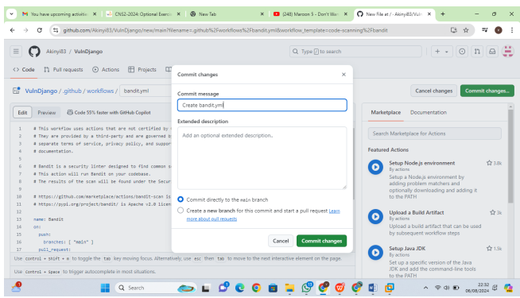

 # Integrating static analysis tools into the development lifecycle-Defender for DevOps 
** Report by: Vallary Akinyi Ogolla  
** CS-CNS06-24142.

## Introduction

In this lab, I explored the integration of static analysis tools into the development lifecycle using Microsoft Defender for DevOps. This exercise involved configuring **Microsoft Security DevOps**, a command-line application that automates the installation, configuration, and execution of various static analysis tools to enhance security and compliance in software development. Through hands-on experience with tools like  **Bandit**, **ESLint**, **CredScan**, and more, I gained practical insights into how these tools can be integrated within **Azure DevOps** and **GitHub Actions** to identify and address potential security vulnerabilities early in the development process.
---

## Objectives
By the end of this lab, I aimed to achieve the following:

- Conduct a Static Application Security Testing (SAST) scan locally using **Bandit**
- Configure the **Microsoft Security DevOps** extension within Azure DevOps
- Set up **Microsoft Security DevOps GitHub Actions** for automated security scanning
- Utilize the **DevOps Security Workbook** to gain insights into security metrics and findings
---
Lab Environment 
- Azure DevOps  
- GitHub Actions
## Methodology
## Exercise 1: Import the vulnerable code 
1. On GitHub, fork the vulnerable code from : [`https://github.com/S2FrdQ/VulnDjango`](https://github.com/S2FrdQ/VulnDjango) 

2. On Azure DevOps -  
   - Create a new **Private project** named `VulnDjango`
   - Navigate to **Repos** and import the code
Exercise 2: SAST scan using Bandit locally.

 

Bandit - The Bandit is a tool designed to find common security issues in Python code. To do this Bandit, processes each file, builds an AST, and runs appropriate plugins against the AST nodes. Once Bandit has finished scanning all the files it generates a report. Bandit was originally developed within the penStack Security Project and later rehomed to PyCQA. 
i. Download the source code locally – git clone https://github.com/S2FrdQ/VulnDjango webappdjango then cd webappdjango 
ii. Install Bandit pip3 install bandit 
iii. If a warning is issued to add Directory to path, add using the below command. 
export PATH="/home/kali/.local/bin:$PATH" To explore bandit --help 
iv. Run the scanner - We are using the tee command here to show the output and store it in a file simultaneously. bandit -r . Basic scan 
bandit -r . -f json | tee bandit-output.json

 

Exercise 3: Configure the Microsoft Security DevOps Azure DevOps extension.

Note: Admin privileges to the Azure DevOps organization are required to install the extension. 
1. Activate Microsoft Security DevOps extension – on your Azure DevOps portal with the VulnDjango project open, click on the marketplace icon > Browse Marketplace.
2. On the Marketplace, search for Microsoft Security DevOps and open it.
3. On the Microsoft Security DevOps page, click on Get it for free.

4. On the next page, select the desired Azure DevOps organization and Install. Proceed to 
organization once installed. 
5. Navigate to your VulnDjango project, then Pipelines and Click New pipeline.
 

6. On the Where is your code? window, select Azure Repos Git (YAML) and select 
the VulnDjango repository. 
7. On Add the following scripts as in into the yaml file
8. Click Save and run and let the pipeline run. You can check progress by going to Pipeline-Pipelines and select the running pipeline.

9. When done, you can view security vulnerabilities found by Microsoft Security DevOps , by clicking Scans
Note: Install the SARIF SAST Scans Tab extension on the Azure DevOps organization in order to ensure that the generated analysis results will be displayed automatically under 
the Scans tab.
Exercise 4: Configure the Microsoft Security DevOps GitHub actions

1. Navigate to your VulnDjango GitHub repo. 
2. Select Actions 
3. Select New workflow. 
4. On the Get started with GitHub Actions page, select set up a workflow yourself
5. In the text box, enter a name for your workflow file.
6. Copy and paste the following sample action workflow into the Edit new file tab.
10. Select Actions and verify the new action is running.
View Scan Results: Navigate to Security > Code scanning alerts > Tool. From the dropdown menu, select Filter by tool. Code scanning findings will be filtered by specific MSDO tools in GitHub. These code scanning results are also pulled into Defender for Cloud recommendation
I also created a Bandit.yml file to also deploy scans using bandit

Once Bandit Scan is configured it adds a YAML file into my workflow then I proceed to commit it. Then it will go in and start the pipeline.
I changed the file name of bandit file and committed the changes
View Scan Results : Navigate to Security > Code scanning alerts > Tool. From the dropdown menu, elect Filter by tool. Code scanning findings will be filtered by specific MSDO tools in GitHub. These code scanning results are also pulled into Defender for Cloud recommendations

Exercise 5: DevOps Security Workbook

 
Navigate to Defender for Cloud, click on Workbooks, then click on DevOps Security (Preview) to launch the Workbook.

Conclusion
Completing this lab allowed me to deepen my understanding of integrating security practices into the DevOps pipeline. I learned how to effectively use static analysis tools to identify vulnerabilities in code, both locally and in CI/CD environments. Configuring Microsoft Security DevOps within Azure DevOps and GitHub provided me with practical skills to automate security checks and enhance the overall security posture of software projects. Additionally, working with the DevOps Security Workbook helped me appreciate the importance of continuous monitoring and reporting on security issues throughout the development lifecycle.